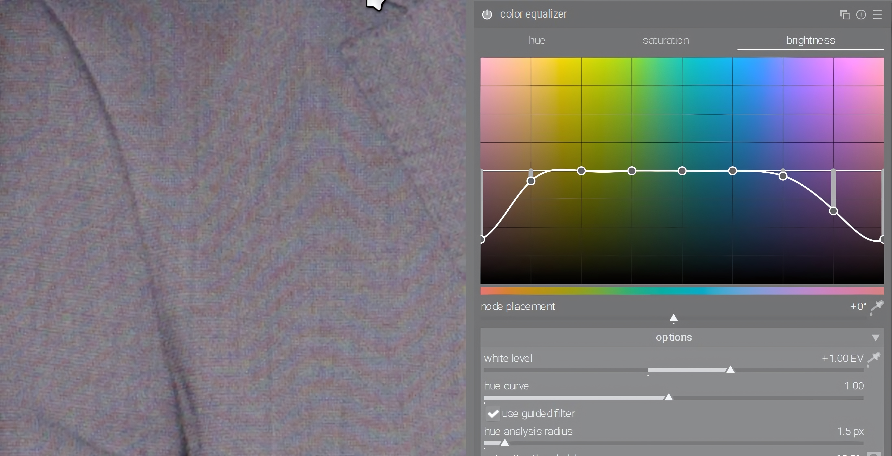
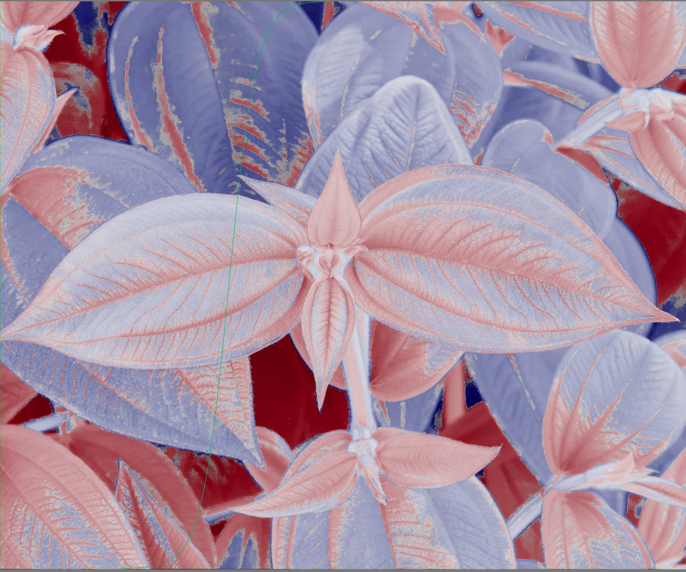

Selectively adjust the hue, saturation, and brightness of pixels based on the color.

Color Equalizer is essentially an implementation of the Color Zones module, but works in the scene referred part of darktable's pixelpipe.

This module works in darktable's UCS 22 color space.

The entire hue range is represented as a curve with eight overlapping sections divided by eight fixed nodes. Choose whether you wish to adjust (select) pixels based on their hue, saturation, and brightness. You can then use the equalizer interface nodes, on their respective tabs, to adjust the hue, saturation, and brightness of ranges of pixels selected via this method.

The distances between nodes cannot be changed but all nodes together can be moved by +/- 23 degrees along the color wheel using the node placement slider, allowing you to fine-tune the selection of a specific color.

---

**Note**: Because all processing in color  equalizer is based on the hue data of each pixel, it can result in increased chroma noise or even increased luma noise if a lot of brightness changes are applied.

---

# module controls

## hue tab

Click+drag the control points on the curve to change the color of all pixels where the mask includes the given color.

## saturation tab

Click+drag the control points on the curve to change the saturation of all pixels where the mask includes the given color.

## brightness tab

Click+drag the control points on the curve to change the lightness of all pixels where the mask includes the given color.

## node placement

node placement
: Move the position of the nodes horizontally.

- By moving the node with the left mouse button pressed.
- Clicking on the node with the right mouse button opens a multi-functional pop-up window where the numerical values can be entered or manipulated by using the arrow keys on the keyboard:
- When hovering the mouse cursor over the node  (the node turns white) and scrolling the mouse wheel while holding down the ctrl+shift keys. Finer steps can be achieved by holding down only the ctrl key.

visualizing color on the equalizer
: Click color picker, then drag the spot selector to the desired part of the image.
: `Ctrl` + click the color picker, then click and drag to draw a rectangular section on the desired part of the image.

## options

white level
: Set the upper bound for the brightness correction via the slider or picker.

hue curve
: Control how the curve is interpolated between control points. Move the slider to the right to make the transitions between the control points more gradual. Move the slider to the left for a sharper transition, but beware that this can result in harsher transitions. This allows the specific hue to be manipulated more precisely without affecting neighboring areas too much. Note: This only applies to the _hue curve_ and not to the _saturation_ and _brightness_ curves!

## guided filter

Guided filter can help to prevent or at least reduce the harsh overlap between manipulated and non-manipulated areas. It is particularly useful for noisy photos or areas with strong local color variations that could lead to strong local color contrasts or steep color gradations.

Here is a piece of meadow with darkened green grass without…

...and with the guided filter switched on. With the guided filter the texture of the grass looks much softer and calmer:

use guided filter
: Enable or disable the use of the guided filter to separate each color node.

hue analysis radius

Guided filter that is used for the chroma analysis which pixels should be considered for manipulation.

The point here is to take into account not only the pixels themselves, but also the _area around them defined by the radius of guided filter_, which ensures that, for example, in the case of very noisy photos or photos with Moiré stripes, the areas between pixels are also taken into account which, in those cases, ensures a more “homogeneous” selection.

Here is an example with a noisy photo of the clothing with Moiré stripes. Hue analysis radius is in its default position (1.5. px):

With hue analysis radius of 10 px. The Moiré effect is now much less pronounced:

With additional denoising it disappears completely:

Note: High values can lead to haloing at the edges!

saturation threshold

The saturation threshold as additional control for the pixel selection. Especially by portraits or photos where we want to enhance the texture, it can be useful to set the saturation threshold when selecting and manipulating pixels.

_Visualization indicator_

shows which pixels have been selected. Red color indicates the selection, and pixels in the blue area are not taken into account.

Here is an example of the color selection of green leaves based on saturation threshold.

With saturation threshold practically disabled (at 0.0%), visualization indicator shows that the leaves are almost completely selected:

With a 20% saturation threshold, _only part of the green with higher saturation_ in the leaves _is selected_ (the red area):

By manipulating _only that high saturation area_, we have now enhanced the texture of the leaves:

: Set the upper bound for the guided filter's saturation threshold. Decrase the value to allow changes to areas with low chromaticity. Increase the value to restrict changes to areas of high chromaticity.

contrast

Contrast slider regulates the steepness of the curve defined by saturation threshold:

contrast value -1:

contrast value 1. The transition is much sharper. Thin green curve in the visualization indicator represents steepness of transition:

: Set the color contrast for the guided filter. Incrase th value to favor sharp transitions between colors and increase color contrast. Decrease the value for smoother color transition.

effect radius

Radius of the guided filter which is used for pixel manipulation to smooth the result while preserving the edges.
This can be useful for both preserving detail or smoothing the result, depending on the subject and the manipulation  that have been performed.

In this case, we want to lighten the pumpkin. Without the guided filter or with a very low radius, we are loosing the details:

If we then increase the radius in order to smooth the result, the details are retained:

To prevent the “bleeding” at the edge of the pumpkin caused by large radius of the guided filter, we can also increase the saturation threshold to limit the manipulation to the pumpkin, which stands out from the surroundings through saturation:

We can also use the visualization indicator to better see which areas have been changed. The pixel areas whose value has been increased are displayed in red and the areas with a reduced value are displayed in blue:

: Set the radius for the guided filter.
